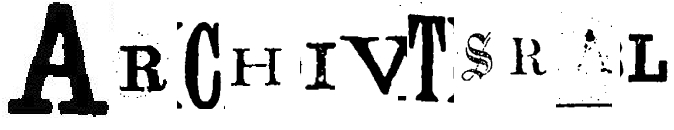

This is the repo for the Hack24 a16z and Mistral hackathon 05-10-24 to 06-10-24.

## Inspiration

Libraries, archives, universities and other institutions around the world have millions and millions of scanned documents. However, as image quality is so poor and the layout is complex, the OCR (if any) on these documents is very poor, making them unusable as text documents. 

LLM's excel at leveraging the broader context of the data provided to them to create coherent and insightful responses. In addition, due to the extensive pre-training, LLMs also have the social context that can be combined with the text as a sanity check, ensuring even higher quality results.

## What it does

### Preparation and primary process

Archivstral is a b2b tool that ingests PDFs, converts them to jpeg, crops the images to article level, and prepares for sending to Pixtral. Pixtral then extracts the text or creates alt-text for any given image and returns the data in markdown. The returned text is then recombined, if necessary, using string matching. The resulting articles are then saved using their article IDs and await post-processing.

### Post-processing

The recovered files are sent to `mistral-large` and classified according to their  International Press Telecommunications Council (IPTC) subject schema. This groups the articles into at least 1 of the following classes
- arts, culture, entertainment and media
- crime, law and justice
- disaster, accident and emergency incident
- economy, business and finance
- education
- environment
- health
- human interest
- labour
- lifestyle and leisure
- politics
- religion
- science and technology
- society
- sport
- conflict, war and peace
- weather

It also generates a secondary classification based on the type of text. These are exclusive, and only a single class is assigned.

- news report
- editorial
- letter
- advert
- review
- poem/song/story
- other

The text can also then be embedded using `mistral-embed`, allowing for more nuanced semantic retrieval strategies using RAG.

## How we built it

As a pipeline, Archivstral doesn't need a UI as it is not intended for direct customer use, the code was all in Python, and exploration was done using Marimo.

## Challenges we ran into

Getting the bounding boxes sorted was a real challenge. Luckily, the team that originally made the data did an excellent job. Otherwise, the project would have failed.

The width-height ratio of the images passed to Pixtral must be carefully managed, as otherwise, the model repeats short phrases from the text until the token limit is reached.

## Accomplishments that we're proud of

This is my first time dealing with images and trying to process such large volumes of data. I am really pleased I managed to get the API working in the evening, giving it a chance to run overnight and process a significant volume of data.

## What we learned

A key thing is to "know your data" Having a clearer understanding of the data and its structure beforehand would have saved a lot of time as most of the first day was spent fiddling with how to deal with the PDFs.

Another valuable lesson was to understand the technology. Learning that Pixtral uses a 16x16 grid made it clear why the errors were occurring when they did and allowed mitigating strategies in the form of image splitting and text stitching.

## What's next for Archivstral

- Fine-tuning: Fine-tuning Pixtral to be able to create bounding boxes would allow the whole process to be performed with Pixtral alone
- Size reduction: It may be possible to prune Pixtral as it contains a lot of information that is not relevant for archive recovery; this would make the process faster and cheaper. 
- Dynamic routing: By classifying OCR text as low or high quality, different paths for the data can be created; high-quality OCR can be sent to mistral-Nemo for light-correction, whereas poor-quality OCR would go to  Pixtral for a full recovery of the text. Such a dynamic process could reduce project costs.

## Business model

The business model for Archivstral would be in data extraction, integrating it into exsisting storage. A key part of the model would be upgrade services, meaning data could be improved along with improvements in technology and methods. 

The model could follow a hybrid pattern similar to other AI companies with an open-source portion and a paid-for service.

# To Do

- Pixtral based image parsing and block classification: The pixtral model can probably parse the structure of a page very efficiently, breaking an image into classified bounding box areas such as.
    - headings
    - text
    - images
    - tables
    - adverts
    - special text (poems)
- There are issues with bounding  box errors, these can probably be cleaned up using heuristics or a simple ML algo as the boxes are usually very wide.